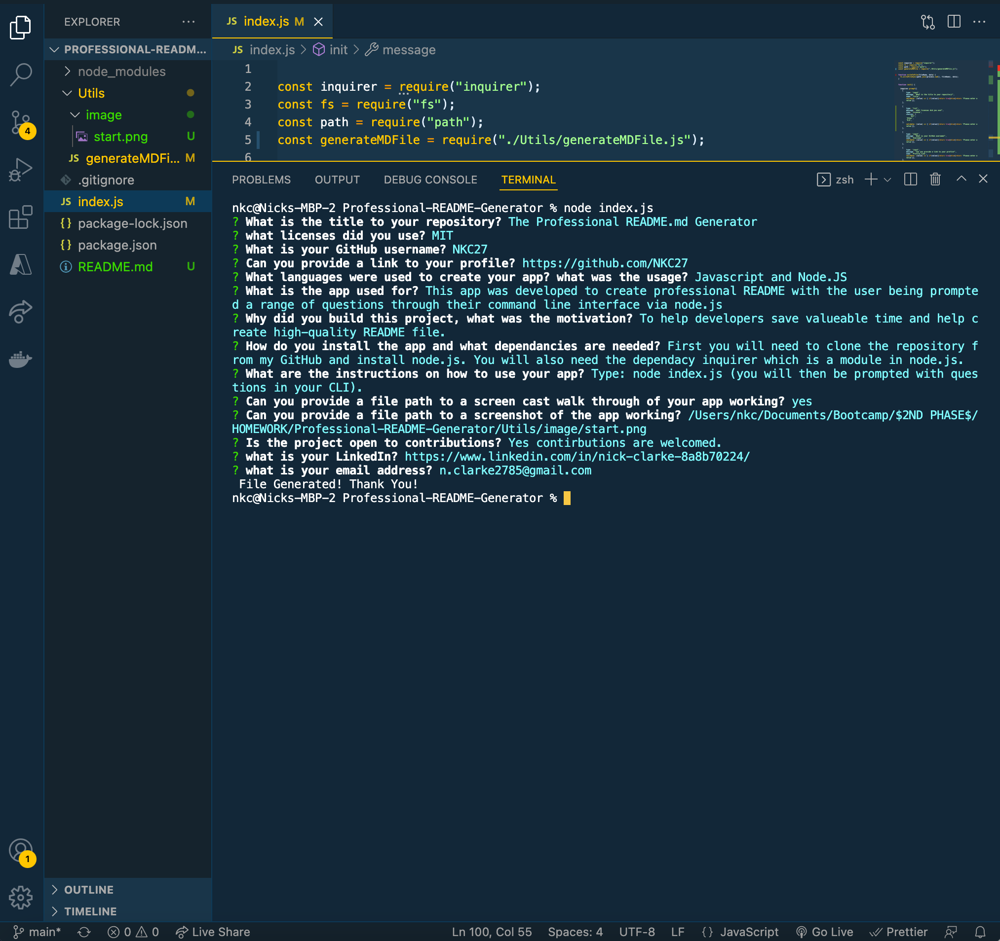

# The Professional README Generator

## Licence

This project is licenced under:

## GitHub Username

  NKC27

# Table of Contents

- [Profile_link](#Profile_link)
- [App_Description](#App_Description)
- [Usage](#Usage)
- [Video_link](#Video_link)
- [Screenshot](#Screenshot)
- [Why_Description](#Why_Description)
- [Installation](#Installation)
- [Instructions](#Instructions)
- [License](#License)
- [Contribution](#Contribution)
- [Questions](#Questions)

# Profile Link

Please see my profile for further documentation.
[GitHub Link](https://github.com/NKC27)

# Description

I have built an app that creates professional README.md files via prompted questions in the users CLI (command line interface) or Terminal.

# Usage

JavaScript and NODE.JS were used in creating this application.

# Video of my app working

Please see below a walkthrough of my app.

# Screenshot

Please see screenshots of the app working.

# Why The app was built & my motivation

I built this app to create high quality README files. My motivation was to help developers in utilising their time and spending less time in creating a professional README.md file. With the template set all the users must do is input the answers to the questions about their project.

# Installation

Please follow the instructions to install the correct dependencies and how to run the app.

1. <mark> Clone the app from the repository </mark>. 2. Then you will need to <mark> install the inquirer module </mark> via: <mark> npm i inquirer. </mark>

Please follow the instructions on how to use the app.

Once the app is installed with the dependencies, then you can type: <mark> node index.js </mark> to run the application.

# Licence

This project has the following license:

MIT

# Contributors

Yes, the project is open to contributions.

## Questions

If you have any questions contact me on [GitHub](https:github.com/NKC27) or contact
<https://github.com/NKC27> at n.clarke2785@gmail.com
